<div align="center">

# 



<br>

<h3><code>omer@github ~ $ ./contributions.sh</code></h3>



<br><br>

<h3><code>omer@github ~ $ whoami</code></h3>

<table>
<tr>

<td valign="top">

</td>

<td valign="top">

</td>

</tr>
</table>

</div>

---

# About Me

```bash
> whoami

Name        : Omer Abdur Rehman
Location    : Pakistan 🇵🇰
Degree      : BS Computer Systems Engineering
Focus       : Artificial Intelligence
Interests   : Machine Learning
              Deep Learning
              NLP
              Computer Vision
Backend     : Python • FastAPI • Django
Frontend    : Flutter • React
Database    : Firebase • MongoDB • SQL
```

---

# Current Work

```text
✓ Smart Stock Predictor
✓ Smart Waste Management System
✓ AI Research
✓ E-Commerce App
✓ Tinkercad
```

---

# Tech Stack

<p align="center">


</p>

---

# Connect With Me

<p align="center">

<a href="https://github.com/Omerabdurrehman">

</a>

<a href="https://linkedin.com/in/YOUR-LINKEDIN">

</a>

<a href="mailto:YOUR_EMAIL">

</a>

</p>